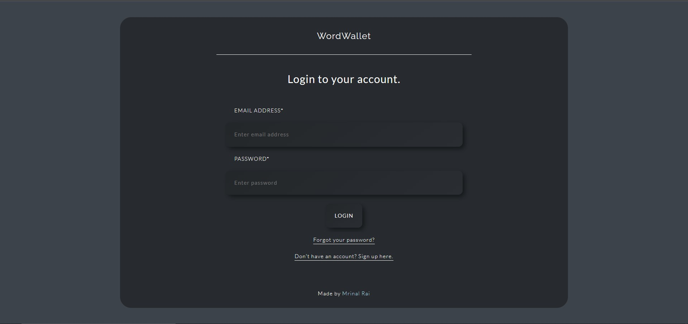
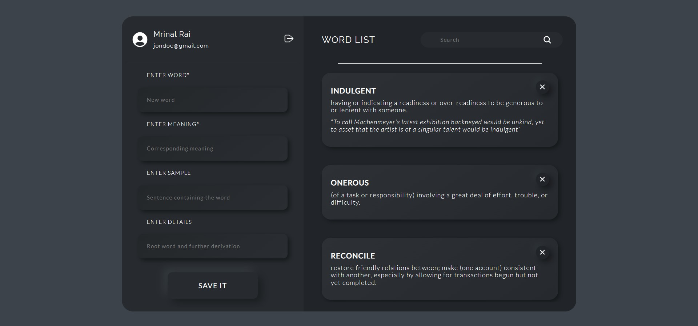
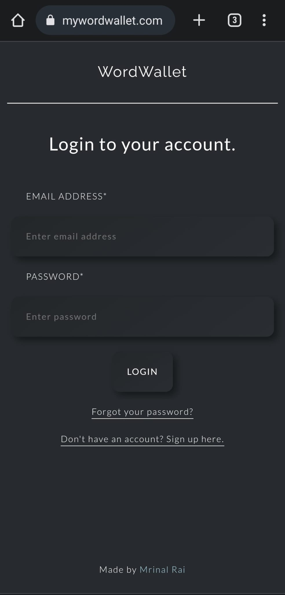
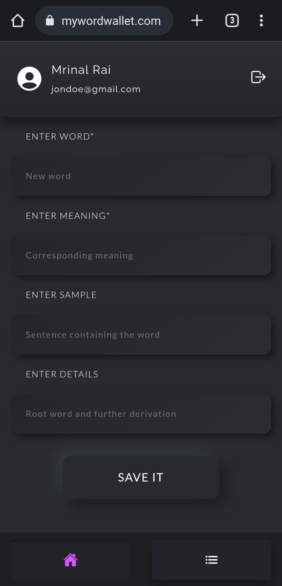
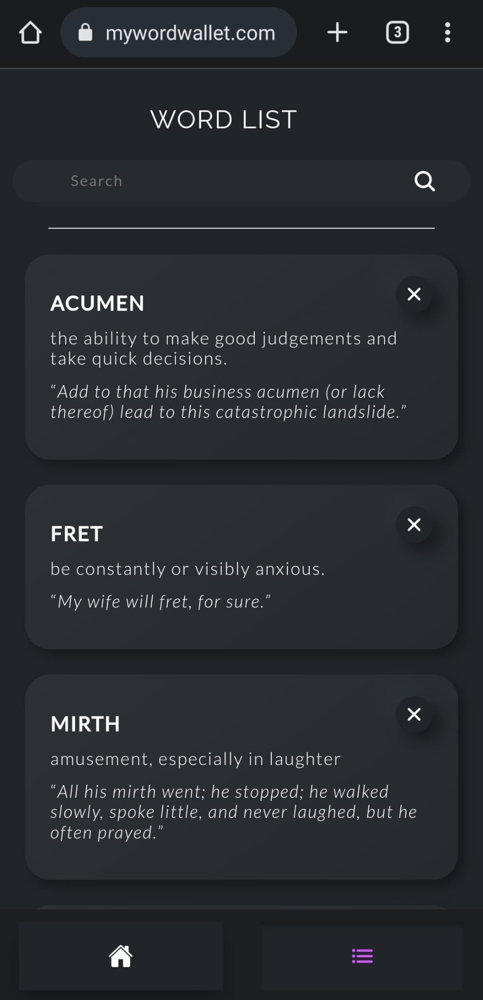

## About The Project:

WordWallet is a three-tier web application that collects words and their meanings via neumorphic mobile and web responsive UI made using HTML5, CSS3, and JavaScript and stores them in the database powered by MongoDB, NodeJS, ExpressJS and Mongoose.

It can be accessed at https://mywordwallet.com/

Frontend Source Code: https://github.com/mrynalrai/wordWallet  
Backend Source Code: https://github.com/mrynalrai/wordWalletAPI

 Below are screenshots of the website. 

## Desktop

## Mobile

  
  
  

