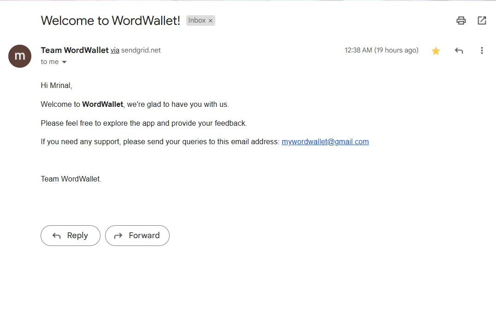

  
Table of Contents

  <ol>
    <li>
      <a href="#about-the-project">About The Project</a>
    </li>
    <li>
      <a href="#built-with">Built With</a>
      <ul>
        <li><a href="#front-end">Front-end</a></li>
        <li><a href="#back-end">Back-end</a></li>
        <li><a href="#hosting-service">Hosting Service</a></li>
        <li><a href="#email-service">Email service</a></li>
      </ul>
    </li>
   <li>
      <a href="#screenshots">Screenshots</a>
      <ul>
        <li><a href="#desktop">Desktop</a></li>
        <li><a href="#mobile">Mobile</a></li>
        <li><a href="#welcome-email">Welcome Email</a></li>
      </ul>
    </li>
  </ol>

## About The Project:

<!-- 
 -->
WordWallet is a mobile and desktop supported web-application that collects words and their meanings via neumorphic mobile and web responsive UI. 
It can be accessed at https://mywordwallet.com/  
                   
## Built With
The technical stack used for developing this application was:
                       
## Front-end: 
  * Vanilla Javascript (used MVC arhcitecture)
  * CSS (no external css library was used) 
  * Webpack
  * Babel
  * Axios (to make REST API calls to the database)
## Back-end:
  * MongoDB
  * Express
  * Mongoose
  * JSONWebToken (for authentication)
  * Nodemailer (for sending email )
## Hosting Service:
  * Netlify (for hosting Front-end and back-end code)
## Email service:
  * Sendgrid for sending emails
<!-- 
 -->
<!-- 
 -->

Frontend Source Code: https://github.com/mrynalrai/wordWallet  
Backend Source Code: https://github.com/mrynalrai/wordWalletAPI
<!-- 
 -->
<!-- 
 Below are screenshots of the website. 
 -->

## Screenshots
Below are few screenshots of the website in desktop and mobile.

## Desktop

## Mobile

  
  
  

## Welcome Email

